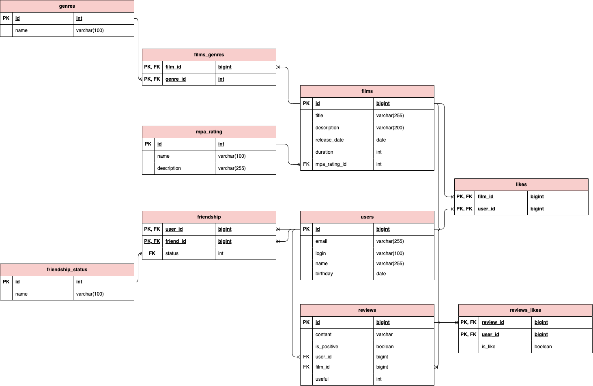

## Database-ER-diagram



## Примеры запросов
Получить названия фильмов, которые относятся к жанру "Боевик"
```
SELECT f.title
FROM films f
         JOIN film_genres fg ON f.film_id = fg.film_id
         JOIN genres g ON fg.genre_id = g.genre_id 
WHERE g.name = 'Боевик';
```

Получить названия фильмов c рейтингом "R"
```
SELECT f.title
FROM films f
         JOIN mpa_rating mr ON f.mpa_rating_id = mr.mpa_rating_id
WHERE mr.name = 'R';
```

Получить список друзей пользователя с id = 1, которые подтвердили дружбу
```
SELECT *
FROM users
WHERE user_id IN (SELECT f.friend_id
                  FROM friendship f
                  WHERE f.user_id = 1
                    AND f.status = 1);
```
Получить название фильма и количество лайков самого популярного фильма
```
SELECT f.title,
       COUNT(*) likes
FROM films f
         JOIN likes l on f.film_id = l.film_id
GROUP BY f.film_id
ORDER BY likes DESC
LIMIT 1;
```

Получить логин пользователя, который поставил больше всех лайков
```
SELECT u.login
FROM users u
WHERE u.user_id = (SELECT user_id
                   FROM (SELECT user_id,
                                COUNT(*) likes
                         FROM likes
                         GROUP BY user_id
                         ORDER BY likes DESC
                         LIMIT 1) ul);
```

Получить название самого популярного фильма в жанре "Комедия" и с рейтингом "PG"
```
SELECT f.title
FROM films f
         JOIN film_genres fg on f.film_id = fg.film_id
         JOIN genres g on fg.genre_id = g.genre_id
         JOIN mpa_rating mr on f.mpa_rating_id = mr.mpa_rating_id
WHERE f.film_id = (SELECT film_id
                   FROM (SELECT film_id,
                                COUNT(*) likes
                         FROM likes
                         GROUP BY film_id
                         ORDER BY likes DESC
                         LIMIT 1) fc)
  AND g.name = 'Комедия'
  AND mr.name = 'PG';
```